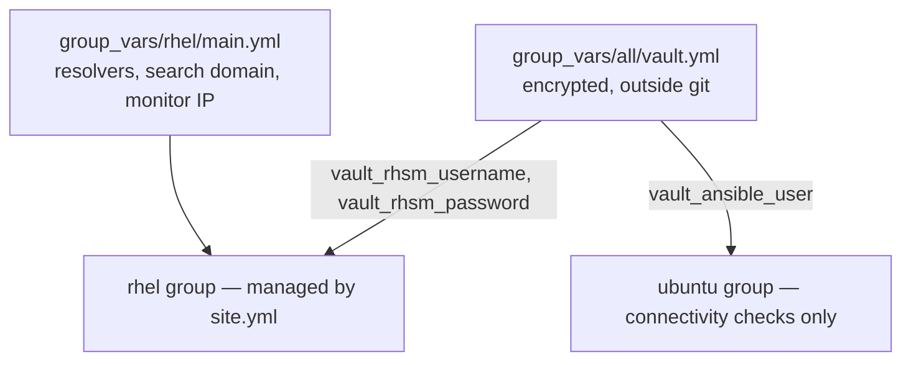

# ansible

[](https://github.com/eugeneivanov-dev/ansible/actions/workflows/lint.yml)

Configuration management for my home lab. This repository holds the Ansible
baseline for the lab's RHEL fleet — the same standard every VM used to get
by hand, rewritten as idempotent roles. A new VM reaches the lab standard by
running a playbook; an existing one proves it still matches by running the
same playbook in check mode.

Project page: [Ansible Baseline for the Lab](https://eugeneivanov.dev/projects/ansible-baseline-for-the-lab/)

## Requirements

- ansible-core 2.21
- collections from `requirements.yml` (`ansible-galaxy collection install -r requirements.yml`)
- managed hosts: RHEL 10, reachable over SSH with Python present
- an Ansible Vault file created from the template (see Secrets below)

## Layout

```
ansible.cfg               defaults: inventory path, remote user
bootstrap.yml             one-time play: creates the automation user on new hosts
site.yml                  main play: full baseline against the rhel group
inventory/hosts.yml       two groups: rhel (managed), ubuntu (connectivity checks only)
group_vars/all/           vault.yml.example — template for the encrypted vault
group_vars/rhel/          site-specific values: resolvers, search domain, monitor address
roles/                    nine baseline roles, one topic each
```

## Variables

Where values come from and which hosts see them:



One vault, visible to both groups — secrets separated by nothing but need:
rhel consumes the subscription credentials, ubuntu consumes the SSH user.
The ubuntu group is deliberately thin for now — reachable and inventoried,
with its own baseline planned as a separate project. Open per-group
configuration lives next to its group. Roles carry no site-specific values.
`bootstrap.yml` additionally carries its own play variable for the public
key path — see Usage.

## Roles and execution order

`site.yml` runs the roles in this order:

1. **registration** — subscription-manager with credentials from vault
2. **ssh_hardening** — key-only SSH, config validated before restart
3. **selinux** — enforcing
4. **firewalld** — deny-by-default zones
5. **chrony** — time sync
6. **updates** — package updates; reboot only behind an explicit flag, off by default
7. **packages** — the lab's standard package set
8. **dns_resolver** — clients point at the lab's own nameservers
9. **monitoring_agent** — node_exporter, reporting to the lab's monitoring host

The order is designed for the worst moment of interruption: security layers
run before updates, so a play that dies halfway leaves the host locked down
and unpatched rather than patched and open.

## Secrets

The encrypted vault file never enters git. The repository carries
`group_vars/all/vault.yml.example` with every expected key; the real
`group_vars/all/vault.yml` is created from it, encrypted with Ansible Vault,
and stays on the machines that run plays. The vault passphrase lives outside
the repository too — its path is provided by the `ANSIBLE_VAULT_PASSWORD_FILE`
environment variable on each machine.

Ansible Vault here is a deliberate temporary minimum: secrets move to
HashiCorp Vault when it arrives as its own service later in the roadmap.

## Git boundary

Development happens on the workstation; execution happens on a dedicated
control VM in the lab.

- workstation: edit, commit, push (read-write key)
- control VM: pull only (read-only deploy key), run plays from the working copy
- no edits and no commits on the control VM — code flows one way

## Usage

```
# once per new host: create the automation user
# (SSH as your initial user whose key is already on the host; -K asks for sudo password)
ansible-playbook bootstrap.yml --limit newhost.example.com -e ansible_user=youruser -K

# full baseline against the rhel group
ansible-playbook site.yml

# drift check against existing hosts
ansible-playbook site.yml --check

# one role only
ansible-playbook site.yml --tags chrony
```

## Scope

This is the OS baseline for RHEL hosts — the layer every service stands on.
The Ubuntu hosts sit in the inventory at connectivity-check level; their
baseline is a separate future project. Application deployment stays with each
service's own mechanism.

This is a homelab, not a reference implementation: the code encodes my lab's
decisions — addressing, DNS names, package choices — and is published as a
working example, not a drop-in solution.

## CI

Every push runs yamllint and ansible-lint (production profile) with pinned
versions — the same commands and versions used locally.

## History

This code was developed in a private repository from day one of the lab's
Ansible project. The public repository starts with a clean history: the
private one carries encrypted secrets and early lab-specific details that
have no place in public git history, even encrypted.

The reasoning behind the transition is written up in
[Going Public: the Decisions Behind Opening My Ansible Repo](https://eugeneivanov.dev/journal/labnotes/going-public-ansible-repo-decisions/),
and the mechanics in
[Going Public: the Ansible Repo Transition, Step by Step](https://eugeneivanov.dev/journal/labnotes/going-public-ansible-repo-transition/).

## License

MIT