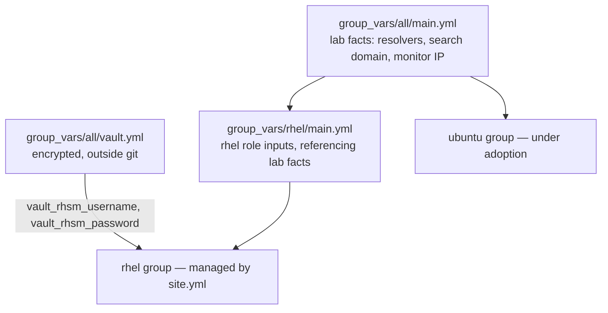

# ansible

[](https://github.com/eugeneivanov-dev/ansible/actions/workflows/lint.yml)

Configuration management for my home lab. This repository holds the Ansible
baseline for the lab's fleets — the same standard every VM used to get
by hand, rewritten as idempotent roles. A new VM reaches the lab standard by
running a playbook; an existing one proves it still matches by running the
same playbook in check mode. The RHEL fleet is fully managed; the Ubuntu
fleet is being brought under the same discipline right now.

Project pages:  
[Ansible Baseline for the Lab](https://eugeneivanov.dev/projects/ansible-baseline-for-the-lab/),  
[Ubuntu Baseline for the Lab](https://eugeneivanov.dev/projects/ubuntu-baseline-for-the-lab/) (in progress)

## Requirements

- ansible-core 2.21
- collections from `requirements.yml` (`ansible-galaxy collection install -r requirements.yml`)
- managed hosts: RHEL 10 and Ubuntu Server 24.04 LTS, reachable over SSH with Python present
- an Ansible Vault file created from the template (see Secrets below)

## Layout

```
ansible.cfg               defaults: inventory path, remote user
bootstrap.yml             one-time play: creates the automation user on new hosts (both fleets)
site.yml                  two plays: rhel baseline (nine roles), ubuntu baseline (roles land as they are written)
inventory/hosts.yml       two flat groups: rhel (managed), ubuntu (under adoption)
group_vars/all/           main.yml — lab facts (resolvers, search domain, monitor address); vault.yml.example — template for the encrypted vault
group_vars/rhel/          rhel role inputs, referencing the lab facts
roles/                    fleet-prefixed baseline roles (rhel_*, ubuntu_* as they arrive), one topic each
```

## Variables

Where values come from and which hosts see them:



Lab facts — values that belong to the lab itself, not to any fleet — live
once in `group_vars/all/main.yml`. Fleet role inputs reference them
(`rhel_dns_resolver_servers: "{{ lab_dns_servers }}"`), so a value changes
in one place and every consumer follows. Roles carry no site-specific
values.

Both fleets connect under one automation user — the `remote_user` default
in `ansible.cfg`. Ubuntu hosts answer it only after `bootstrap.yml` has run
against them; until a host is adopted, it shows up as unreachable in
full-fleet runs, which is exactly the adoption backlog made visible.

## Roles and execution order

Role names and tags carry the fleet prefix: `rhel_*` today, `ubuntu_*` as
the Ubuntu roles are written. `site.yml` runs the rhel play in this order:

1. **rhel_registration** — subscription-manager with credentials from vault
2. **rhel_ssh_hardening** — key-only SSH, config validated before restart
3. **rhel_selinux** — enforcing
4. **rhel_firewalld** — deny-by-default zones
5. **rhel_chrony** — time sync
6. **rhel_updates** — package updates; reboot only behind an explicit flag, off by default
7. **rhel_packages** — the lab's standard package set
8. **rhel_dns_resolver** — clients point at the lab's own nameservers
9. **rhel_monitoring_agent** — node_exporter, reporting to the lab's monitoring host

The order is designed for the worst moment of interruption: security layers
run before updates, so a play that dies halfway leaves the host locked down
and unpatched rather than patched and open. The ubuntu play mirrors the same
principle as its roles arrive.

## Secrets

The encrypted vault file never enters git. The repository carries
`group_vars/all/vault.yml.example` with every expected key; the real
`group_vars/all/vault.yml` is created from it, encrypted with Ansible Vault,
and stays on the machines that run plays. The vault passphrase lives outside
the repository too — its path is provided by the `ANSIBLE_VAULT_PASSWORD_FILE`
environment variable on each machine.

Ansible Vault here is a deliberate temporary minimum: secrets move to
HashiCorp Vault when it arrives as its own service later in the roadmap.

## Git boundary

Development happens on the workstation; execution happens on a dedicated
control VM in the lab.

- workstation: edit, commit, push (read-write key)
- control VM: pull only (read-only deploy key), run plays from the working copy
- no edits and no commits on the control VM — code flows one way

## Usage

```
# once per new host: create the automation user
# (SSH as your initial user whose key is already on the host; -K asks for sudo password)
ansible-playbook bootstrap.yml --limit newhost.example.com -e ansible_user=youruser -K

# full baseline
ansible-playbook site.yml

# drift check against existing hosts
ansible-playbook site.yml --check

# one role only
ansible-playbook site.yml --tags rhel_chrony

# scope a run to one host while developing
ansible-playbook site.yml --limit test1.lab.eugeneivanov.dev
```

## Scope

This is the OS baseline for the lab's hosts — the layer every service stands
on. The RHEL fleet is fully managed. The Ubuntu fleet is being brought under
the same discipline by the
[Ubuntu Baseline project](https://eugeneivanov.dev/projects/ubuntu-baseline-for-the-lab/):
parallel roles built on Ubuntu's native mechanisms, in this repository, on
this workflow. Application deployment stays with each service's own
mechanism.

This is a homelab, not a reference implementation: the code encodes my lab's
decisions — addressing, DNS names, package choices — and is published as a
working example, not a drop-in solution.

## CI

Every push runs yamllint and ansible-lint (production profile) with pinned
versions — the same commands and versions used locally.

## History

This code was developed in a private repository from day one of the lab's
Ansible project. The public repository starts with a clean history: the
private one carries encrypted secrets and early lab-specific details that
have no place in public git history, even encrypted.

The reasoning behind the transition is written up in
[Going Public: the Decisions Behind Opening My Ansible Repo](https://eugeneivanov.dev/journal/labnotes/going-public-ansible-repo-decisions/),
and the mechanics in
[Going Public: the Ansible Repo Transition, Step by Step](https://eugeneivanov.dev/journal/labnotes/going-public-ansible-repo-transition/).

## License

MIT