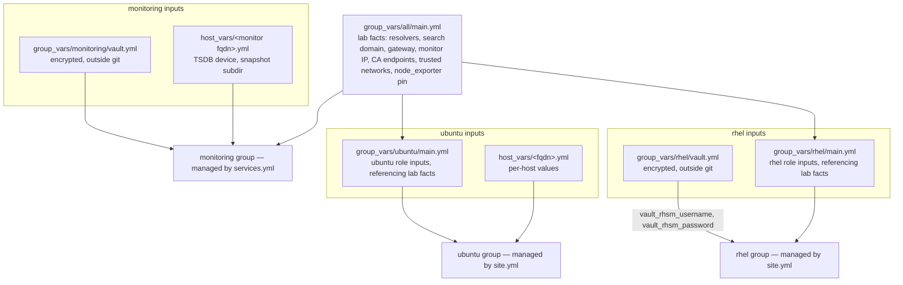

[](https://eugeneivanov.dev)

# ansible

[](https://github.com/eugeneivanov-dev/ansible/actions/workflows/lint.yml)

Configuration management for the infrastructure lab behind [eugeneivanov.dev](https://eugeneivanov.dev). This repository holds two layers. The OS baseline: the standard every VM used to get by hand, rewritten as idempotent roles for both fleets — RHEL and Ubuntu. And the services layer on top of it: the lab's monitoring stack — Prometheus, Alertmanager, Grafana, and Blackbox Exporter as native systemd services — built, migrated to production, and proven by clean-install runs. A new VM reaches the lab standard by running a playbook; an existing one proves it still matches by running the same playbook in check mode.

Project pages:  
[Ansible Baseline for the Lab](https://eugeneivanov.dev/projects/ansible-baseline-for-the-lab/)  
[Ubuntu Baseline for the Lab](https://eugeneivanov.dev/projects/ubuntu-baseline-for-the-lab/)

## Requirements

- ansible-core 2.21
- collections from `requirements.yml` (`ansible-galaxy collection install -r requirements.yml`)
- managed hosts: RHEL 10 and Ubuntu Server 24.04 LTS, reachable over SSH with Python present
- Ansible Vault files created from the templates (see Secrets below)

## Layout

```
ansible.cfg               defaults: inventory path, remote user
bootstrap.yml             one-time play: creates the automation user on new hosts (both fleets)
site.yml                  two plays: rhel baseline (nine roles), ubuntu baseline (nine roles)
services.yml              services layer on top of the baseline: the monitoring stack (four svc_* roles)
inventory/hosts.yml       three groups: rhel, ubuntu — the managed fleets; monitoring — the services-layer host
group_vars/all/           main.yml — lab facts (resolvers, search domain, gateway, monitor address, CA endpoints, trusted networks, node_exporter pin)
group_vars/rhel/          rhel role inputs, referencing the lab facts; vault.yml.example — template for the encrypted vault
group_vars/ubuntu/        ubuntu role inputs, referencing the lab facts
group_vars/monitoring/    monitoring services inputs; vault.yml.example — template for the services vault
host_vars/                per-host values: netplan address, app ports as port + source pairs, TSDB device on the monitoring host
roles/                    baseline roles (rhel_*, ubuntu_*) and services roles (svc_*), one topic each
tests/                    CI fixtures: render.yml renders the monitoring config templates with fake values for validation
```

## Variables

Where values come from and which hosts see them:



Lab facts — values that belong to the lab itself, not to any fleet — live once in `group_vars/all/main.yml`. Fleet role inputs reference them (`rhel_dns_resolver_servers: "{{ lab_dns_servers }}"`), so a value changes in one place and every consumer follows. Roles carry no site-specific values. Secrets sit in the group that consumes them: the baseline vault lives in `group_vars/rhel/`, visible to the rhel play only, and the services layer follows the same rule with its own vault in `group_vars/monitoring/`.

A host_vars file declares only what makes the host unique. The minimal one is a single line — the host's address. The monitoring host declares two: the block device for the TSDB volume (deliberately not defaulted — disk enumeration order differs between installs, and the role refuses to touch a device that already carries a signature) and its snapshot subdirectory on the NAS dump share.

Both fleets connect under one automation user — the `remote_user` default in `ansible.cfg`. A host answers it after `bootstrap.yml` has run against it; until then it shows up as unreachable in full-fleet runs.

## Roles and execution order

### OS baseline (site.yml)

Role names and tags carry the fleet prefix: `rhel_*` and `ubuntu_*`. `site.yml` runs the rhel play in this order:

1. **rhel_registration** — subscription-manager with credentials from vault
2. **rhel_ssh_hardening** — key-only SSH, config validated before restart, effective policy asserted via `sshd -T`
3. **rhel_selinux** — enforcing
4. **rhel_firewalld** — deny-by-default zones
5. **rhel_chrony** — time sync
6. **rhel_updates** — package updates; reboot only behind an explicit flag, off by default
7. **rhel_packages** — the lab's standard package set
8. **rhel_dns_resolver** — clients point at the lab's own nameservers
9. **rhel_monitoring_agent** — node_exporter, reporting to the lab's monitoring host

The ubuntu play follows in this order:

1. **ubuntu_ssh_hardening** — key-only SSH via a drop-in named to sort before cloud-init's; completes the transition from socket-activated sshd to the classic service, terminating the leftover socket-spawned listener; config validated before restart, effective policy asserted via `sshd -T`
2. **ubuntu_apparmor** — asserts AppArmor is active with enforcing profiles
3. **ubuntu_ufw** — deny-by-default; ssh owned by an explicit 22/tcp rule, the distro's OpenSSH profile rule removed; app ports declared per host as port + source pairs, so every rule names its consumer
4. **ubuntu_chrony** — time sync via chrony, replacing systemd-timesyncd
5. **ubuntu_updates** — unattended-upgrades removed, updates run through the playbook only; reboot behind an explicit flag, off by default
6. **ubuntu_packages** — the lab's standard package set
7. **ubuntu_netplan** — owns the host's netplan configuration; cloud-init network config disabled
8. **ubuntu_monitoring_agent** — node_exporter as a pinned binary, replacing the packaged exporter; optional textfile collector directory for hosts that publish their own metrics
9. **ubuntu_hostname** — static hostname set to the inventory FQDN, owning the 127.0.1.1 entry in /etc/hosts

The order is designed for the worst moment of interruption: security layers run before updates, so a play that dies halfway leaves the host locked down and unpatched rather than patched and open. Both plays follow the same principle.

### Services layer (services.yml)

The monitoring stack runs on a dedicated RHEL host in the `monitoring` group — every component a pinned native systemd service, no containers. The prober precedes Prometheus so a clean run brings the probe endpoint up before anything scrapes it:

1. **svc_blackbox_exporter** — Blackbox Exporter as a pinned binary: versioned /opt install behind a symlink, hardened unit, loopback-only listener; probe modules rendered from a template (http, https with enforced TLS, https without verification for self-signed appliances, tcp, dns)
2. **svc_prometheus** — Prometheus as a pinned binary on a dedicated TSDB volume (LVM, xfs, protective contract on the block device), loopback-only listener, explicit retention by time and size; fleet scrape targets generated from the inventory groups via file_sd, blackbox probe targets rendered from vault-held lists; alert rules as static files split by metric source (node, prometheus, watchdog, blackbox), every rule carrying a severity, validated with promtool on deploy; TSDB snapshot backup — snapshot via the admin API, copied to the NAS over NFS with rotation, driven by a systemd timer
3. **svc_alertmanager** — Alertmanager as a pinned binary, loopback-only: severity-based routing (critical / warning / info) to email receivers, a watchdog receiver pinging an external dead man's switch, inhibit rules so a down host suppresses its own warnings; SMTP credentials from vault; config validated with amtool on deploy
4. **svc_grafana** — Grafana from the vendor rpm repository (version pinned, protected from fleet updates via excludepkgs), TLS from the lab's internal CA over ACME with automatic renewal, unified alerting disabled — Alertmanager owns alerting; datasource and dashboards provisioned entirely from git, UI saves rejected by design; firewall opens the UI to the lab's trusted networks only

Prometheus and Alertmanager never listen on the network — Grafana is the stack's only exposed endpoint. The alerting chain is closed from outside: an always-firing Watchdog alert pings an external service, so silence of the whole stack is itself an alert.

## Package baseline

The standard set both `*_packages` roles install — general-purpose tools every host carries regardless of its service:

| Fleet  | Packages |
|--------|----------|
| rhel   | vim, bash-completion, tar, policycoreutils-python-utils, bind-utils, openssl |
| ubuntu | vim, bash-completion, tar, bind9-dnsutils, openssl, qemu-guest-agent |

The sets differ where the platforms do: SELinux tooling exists only on RHEL, `bind-utils` is named `bind9-dnsutils` on Ubuntu, and `qemu-guest-agent` ships preinstalled on the RHEL template but not in the Ubuntu installer. Changing a set means changing the role and this table in the same commit.

## Secrets

The encrypted vault files never enter git. The repository carries a `vault.yml.example` with every expected key next to each real vault's location — `group_vars/rhel/` for the baseline, `group_vars/monitoring/` for the services layer; the real `vault.yml` is created from the template, encrypted with Ansible Vault, and stays on the machines that run plays. The vault passphrase lives outside the repository too — its path is provided by the `ANSIBLE_VAULT_PASSWORD_FILE` environment variable on each machine.

The monitoring vault holds the SMTP credentials and alert destination for Alertmanager, the Grafana admin password, the dead man's switch ping URL, and the blackbox probe target lists — the targets are treated as secrets, and their structure is mirrored by the example file and the CI fixtures with fake values.

Ansible Vault here is a deliberate temporary minimum: secrets move to HashiCorp Vault when it arrives as its own service.

## Git boundary

Development happens on the workstation; execution happens on a dedicated control VM in the lab.

- workstation: edit, commit, push (read-write key)
- control VM: pull only (read-only deploy key), run plays from the working copy
- no edits and no commits on the control VM — code flows one way

## Usage

```
# once per new host: create the automation user
# (SSH as your initial user whose key is already on the host; -K asks for sudo password)
ansible-playbook bootstrap.yml --limit newhost.example.com -e ansible_user=youruser -K

# full baseline
ansible-playbook site.yml

# services layer (monitoring group)
ansible-playbook services.yml

# drift check against existing hosts
ansible-playbook site.yml --check

# one role only
ansible-playbook site.yml --tags rhel_chrony

# scope a run to one host
ansible-playbook site.yml --limit newhost.example.com
```

## Scope

Two layers are managed from here. The OS baseline — the layer every service stands on; both fleets are fully managed. And the services layer — the monitoring stack as code: the production monitoring host is built by playbook alone, was migrated from its hand-built predecessor by a clean cut-over, and its roles are proven by clean-install runs on disposable test VMs before touching the live host. Application deployment for the remaining services stays with each service's own mechanism.

What stays outside the code by design: VM creation and OS installation, DNS zone records, the NAS export allow-list, and runtime operations like alert silences — procedures, not configuration.

The lab is the proving ground behind [Proven Infrastructure Group](https://proveninfra.com): methods are rehearsed here before they reach client production. The code encodes the lab's decisions — addressing, DNS names, package choices — and is published as a working example, not a drop-in solution.

## CI

Every push runs yamllint and ansible-lint (production profile) with pinned versions — the same commands and versions used locally. A second job validates the monitoring configs: alert rules are checked directly with promtool, and the Prometheus, Alertmanager, and Blackbox Exporter templates — including the file_sd target files — are rendered with fixture values (`tests/`), then checked with promtool and amtool — the same pinned versions the stack runs.

## History

This code was developed in a private repository from day one of the lab's Ansible project. The public repository starts with a clean history: the private one carries encrypted secrets and early lab-specific details that have no place in public git history, even encrypted.

The reasoning behind the transition is written up in [Going Public: the Decisions Behind Opening My Ansible Repo](https://eugeneivanov.dev/journal/labnotes/going-public-ansible-repo-decisions/), and the mechanics in [Going Public: the Ansible Repo Transition, Step by Step](https://eugeneivanov.dev/journal/labnotes/going-public-ansible-repo-transition/).

## License

MIT